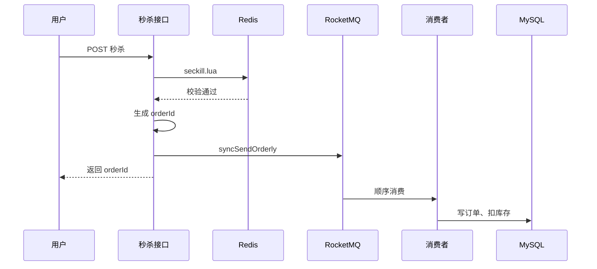

<div align="center">

# LiveHub

**黑马点评的个人改进版**

[]()
[]()
[]()
[]()

跟着 [黑马点评](https://www.itheima.com/) 做完之后，又自己改了一轮——主要是秒杀那块扛不住压测。

</div>

---

## 这个项目是什么

仓库里的代码是在黑马「点评系统」课上跟出来的，业务大体没动：商铺、优惠券、博客、签到这些都在。

课程版秒杀能跑，但我用 JMeter 压了一下之后问题比较明显：

- 同步下单把连接池打满了
- `update stock` 那行成了热点，P99 能到 800ms 以上
- 多实例部署时，一人一单靠 JVM 锁兜不住
- 缓存击穿、穿透当时也没想透该用哪种方案

后面就按模块慢慢改：业务接口尽量和教程对齐，动得比较多的是缓存、秒杀、MQ、限流和 Docker 部署。包名还是 `com.hmdp`，方便和原版对照。

面试怎么讲、细节为什么这样选，写在仓库根目录的 [`点评项目拷打-优化版.md`](../点评项目拷打-优化版.md) 里。

---

## 和课程版比，动了哪些地方

| 模块 | 课程里常见写法 | 我这边的改法 | 原因（简述） |
|------|----------------|--------------|--------------|
| 缓存击穿 | 互斥锁重建 | 逻辑过期 | 券详情晚几秒更新问题不大，不想大量线程堵在锁上 |
| 缓存穿透 | 课上讲过几种 | 空值 + 短 TTL | 商铺量不大，够用了 |
| 热 Key | 单层 Redis | Caffeine + Redis | 秒杀详情访问太集中，想减轻 Redis 压力 |
| 秒杀 | 乐观锁 / Redisson + 同步写库 | Redis + Lua | 资格判断不想走 MySQL |
| 异步下单 | Stream / 阻塞队列等 | RocketMQ | 需要重试、死信，后来从 Kafka 换成了 RocketMQ |
| 消费失败 | 简单监听 | 重试 3 次 + 死信队列 | 落库失败别静默丢消息 |
| 限流 | 课上讲得少 | ZSet 滑动窗口 + AOP | 防刷接口用 |
| 部署 | 本机装中间件 | Docker Compose | 换机器不用重新配一遍环境 |

不同期课程实现不一样（有的用 Stream，有的用 Kafka），上表说的是**我学的那套同步写法**，以及这个仓库现在的样子。

---

## 秒杀是怎么一步步改过来的

```
跟课跑通
  → JMeter 压测，DB 锁和热点 update 顶不住
  → 上乐观锁，超卖好了，QPS 还是低
  → Redis 预减库存 + 分布式锁，好一点，锁还在抢
  → Lua 把库存和一人一单写进一个脚本，接口不再碰 MySQL
  → 下单改发 RocketMQ，消费者慢慢落库
  → 补了二级缓存、限流、Docker
```

本地 JMeter（1000 线程、200 库存，机器很一般）：

| 阶段 | 平均 | P99 | 吞吐 |
|------|------|-----|------|
| 同步 DB + 锁 | ~500ms | ~800ms | ~1000 QPS |
| Lua + RocketMQ（现在） | ~176ms | ~545ms | ~1500 QPS |

数字只能参考趋势，换台机器会差很多。对我来说关键是：热点 SQL 从接口链路里拿掉了。

---

## 技术栈

Spring Boot 2.3 · MyBatis-Plus · MySQL 8 · Redis 7 · RocketMQ 4.9 · Caffeine · Redisson · Docker Compose

---

## 秒杀链路（当前代码）



| 项 | 值 |
|----|-----|
| Topic | `seckill-order` |
| 消费组 | `seckill-group` |
| 重试 | 最多 3 次，之后进 `%DLQ%seckill-group%` |
| 幂等 | 消息里带 `orderId`，重复插入靠主键挡住 |

---

## 怎么跑起来

### Docker（省事）

```bash
cd LiveHub-main
docker compose up -d --build
```

在仓库根目录 `LiveHub` 也可以直接 `docker compose up -d --build`（有转发配置）。

| 服务 | 地址 |
|------|------|
| API | http://localhost:18081 |
| MySQL | `127.0.0.1:13306`，root / root |
| Redis | `127.0.0.1:16379` |
| RocketMQ | NameServer `127.0.0.1:9876` |

```bash
curl http://localhost:18081/shop-type/list
docker compose logs -f app    # 登录验证码在日志里
```

镜像拉不动的话，compose 里默认走了 DaoCloud。构建阶段超时可以先 `mvn -DskipTests package`，再 `docker compose -f docker-compose.package.yml up -d --build`。

### 本地开发

中间件自己起（或 Docker 只起 MySQL / Redis / RocketMQ），改 `application.yaml` 里的连接，然后：

```bash
mvn spring-boot:run
```

默认端口 `8081`。

---

## 目录

```
LiveHub/
├── LiveHub-main/                 # 后端
├── 点评项目拷打-优化版.md
└── 点评项目拷打.md
```

改得比较多的几个文件：

- `VoucherOrderServiceImpl.java` — Lua 校验 + 发 MQ
- `SeckillVoucherListener.java` / `SeckillVoucherDltListener.java` — 消费和死信
- `CacheClient.java` — 逻辑过期
- `seckill.lua`
- `docker-compose.yml`

商铺、博客、签到、GEO 这些业务模块基本还是课程那套，没专门重写。

---

## 说明

- 业务和骨架来自黑马点评实战课，这个仓库是个人练习时的改动记录，不是官方版本。
- [`点评项目拷打-优化版.md`](../点评项目拷打-优化版.md)：按模块整理的面试笔记，和当前代码对齐。
- [`点评项目拷打.md`](../点评项目拷打.md)：早期长文备份。

---

## License

MIT
